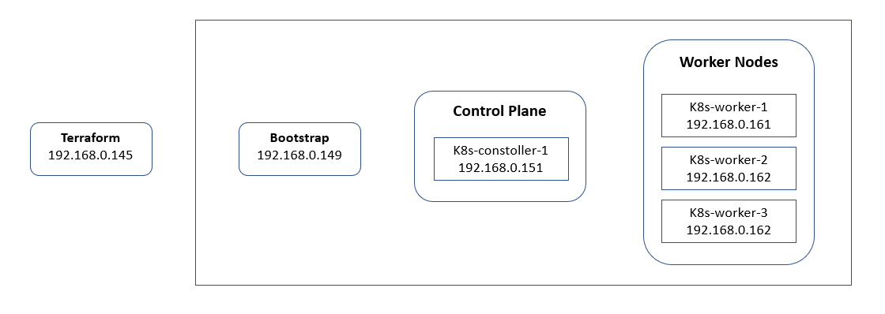

## 1. Prerequisites

- Proxmox server.
- An Ubuntu 22.04 template provisioned on Proxmox.
- Terraform. Please refer Terraform installation on Ubuntu 22.04 for installation of Terraform.
- A way to provision static ip addresses mapped to mac addresses (I used a home router).

## 2. System Diagaram

### Single Controller and Three Worker Nodes

## 3. Configuration

### Infrastructure Configuration

A terraform script creates the machines required for the setup. The script is available in terraform/five-nodes path. Script is using Telmate/proxmox provider to create virtual machines in Proxmox server from an Ubuntu 22.04 machine template. So make sure that an Ubuntu 22.04 server template is available in Proxmox server.

#### System configuration for individual nodes

- Bootstrap, CPU - 1 core, RAM - 2 GB
- k8s-controller-1,  CPU - 2 core, RAM - 4 GB
- k8s-worker-1, CPU - 2 core, RAM - 4 GB
- k8s-worker-2, CPU - 2 core, RAM - 4 GB
- k8s-worker-3, CPU - 2 core, RAM - 4 GB